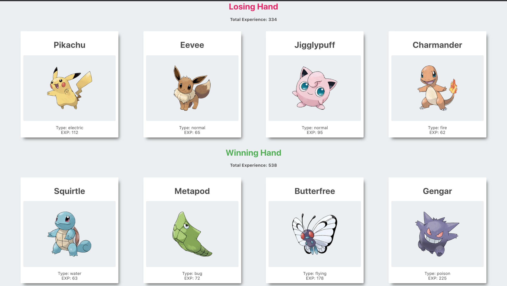

# Pokémon Battle

A small React game where Pokémon are pulled live from the [PokéAPI](https://pokeapi.co/)
and pitted against each other. Built with **React 18** and **Vite**.

## Game modes

- **⚡ Quick Battle** — a random roster is split into two hands; the hand with the
  higher total base experience wins. Reshuffle with **Play Again**, track the running
  score, and click any card to inspect its stats.
- **⚔️ Duel** — draft a team of four, then duel the CPU card-by-card. Each round you
  pick one of your cards and a stat (HP / Attack / Defense / Speed); the higher value
  wins the round. Most round wins takes the duel.

If the PokéAPI can't be reached, the app falls back to a bundled offline roster.

## Getting started

```bash
npm install
npm run dev      # start the dev server at http://localhost:3000
```

## Available scripts

| Command           | Description                                          |
| ----------------- | ---------------------------------------------------- |
| `npm run dev`     | Start the Vite dev server with hot-module reloading. |
| `npm run build`   | Build an optimized production bundle into `build/`.  |
| `npm run preview` | Serve the production build locally to preview it.    |

## Tech stack

- [React 18](https://react.dev/)
- [Vite](https://vite.dev/)
- [PokéAPI](https://pokeapi.co/) for Pokémon data and artwork
